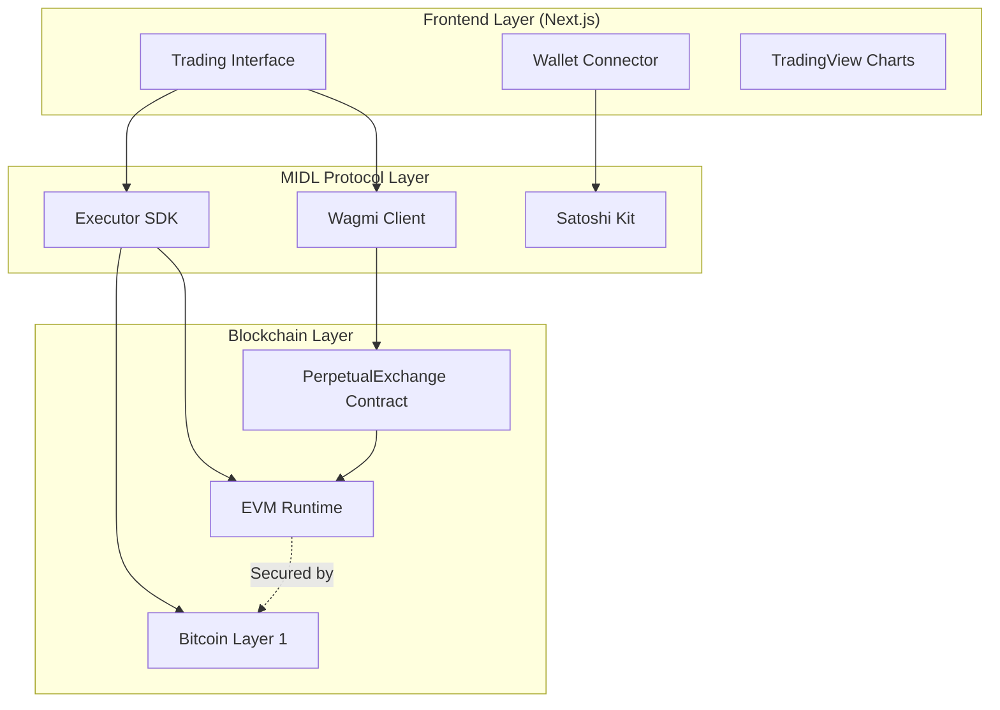
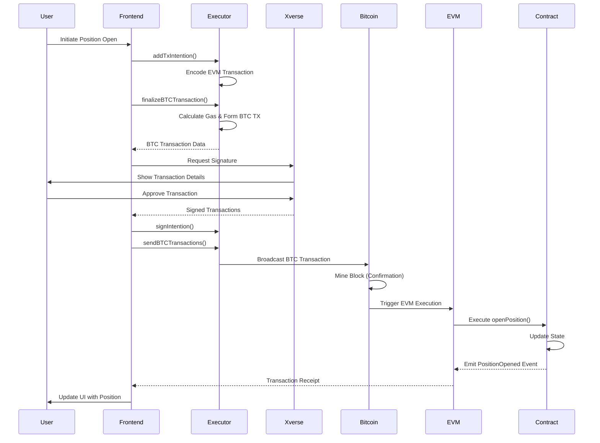
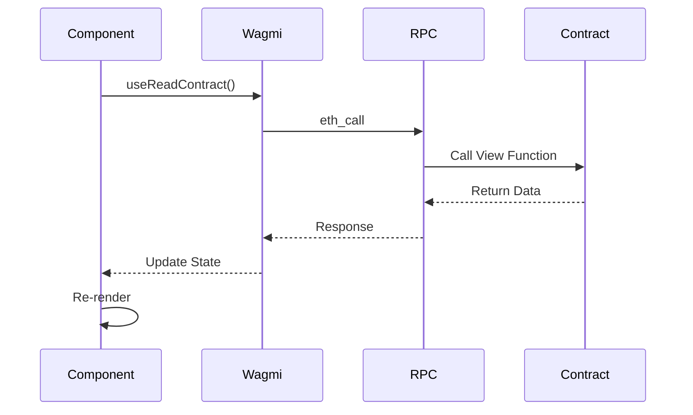
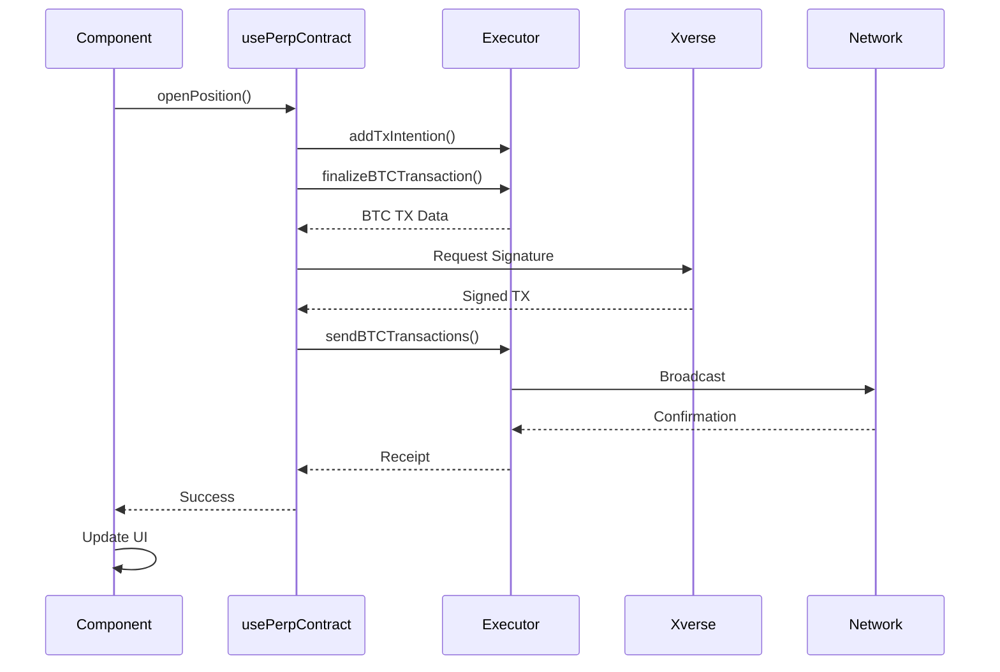

# Architecture Documentation - MIDL DeFi Exchange

Technical architecture and design decisions for the MIDL DeFi Exchange.

## System Overview

The MIDL DeFi Exchange is a decentralized perpetual trading platform that combines Bitcoin's security with EVM smart contract functionality through the MIDL Protocol.

### High-Level Architecture



## Technology Stack

### Frontend

- **Framework**: Next.js 16 (App Router)
- **Language**: TypeScript 5
- **UI Library**: React 19
- **Styling**: Tailwind CSS 4
- **Component Library**: Radix UI, shadcn/ui
- **State Management**: Jotai
- **Animations**: Motion (Framer Motion)
- **Charts**: TradingView Lightweight Charts

### Blockchain

- **Protocol**: MIDL (Bitcoin L1 + EVM)
- **Smart Contracts**: Solidity 0.8.28
- **Development**: Hardhat 2.28.3
- **Deployment**: @midl/hardhat-deploy
- **Wallet**: Xverse (via @midl/satoshi-kit)

### Libraries

- **MIDL SDK**: @midl/core, @midl/react, @midl/executor
- **EVM Interaction**: viem 2.14.16, wagmi 2.14.16
- **Data Fetching**: TanStack Query (React Query)
- **Notifications**: Sonner

## Core Components

### 1. Smart Contract Layer

#### PerpetualExchange.sol

**Purpose**: Manages perpetual trading positions on-chain.

**Key Functions:**

```solidity
// Deposit funds
function deposit() external payable

// Open leveraged position
function openPosition(
    uint256 size,
    uint256 price,
    uint256 leverage,
    bool isLong
) external

// Close position and realize PnL
function closePosition(
    uint256 positionId,
    uint256 exitPrice
) external

// View functions
function getPositions(address trader) external view returns (Position[])
function getBalance(address user) external view returns (uint256)
```

**Data Structures:**

```solidity
struct Position {
    address trader;
    uint256 size;
    uint256 entryPrice;
    uint256 leverage;
    bool isLong;
    uint256 margin;
    uint256 timestamp;
}
```

**Events:**

```solidity
event PositionOpened(address indexed trader, uint256 indexed positionId, ...)
event PositionClosed(address indexed trader, uint256 indexed positionId, int256 pnl)
event Deposit(address indexed user, uint256 amount)
event Withdrawal(address indexed user, uint256 amount)
```

### 2. Frontend Architecture

#### App Structure

```
apps/dashboard/
├── app/                    # Next.js App Router
│   ├── layout.tsx         # Root layout with providers
│   ├── page.tsx           # Main trading interface
│   ├── holdings/          # Positions page
│   ├── trenches/          # Additional features
│   └── explorer/          # Market explorer
├── components/            # React components
│   ├── header/           # Navigation header
│   ├── order-form/       # Trading form
│   ├── orderbook/        # Order book display
│   ├── tradingview-chart/ # Price charts
│   └── ui/               # Reusable UI components
├── hooks/                # Custom React hooks
│   ├── use-midl-wallet.ts    # Wallet connection
│   ├── use-perp-contract.ts  # Contract interaction
│   ├── use-trade.ts          # Trading state
│   └── use-binance-data.ts   # Market data
├── lib/                  # Utilities
│   ├── constants.ts      # Contract ABIs, addresses
│   └── utils.ts          # Helper functions
├── states/               # Jotai atoms
│   ├── auth.ts          # Authentication state
│   ├── trade.ts         # Trading state
│   └── ui.ts            # UI state
└── context/             # React context providers
    └── midl.tsx         # MIDL provider wrapper
```

### 3. Transaction Flow

#### MIDL Transaction Architecture

Every write operation on MIDL requires both a Bitcoin transaction and an EVM transaction:



#### Implementation

```typescript
// 1. Add Intention
addTxIntention({
  reset: true,
  intention: {
    evmTransaction: {
      to: CONTRACT_ADDRESS,
      data: encodeFunctionData({
        abi: CONTRACT_ABI,
        functionName: "openPosition",
        args: [size, price, leverage, isLong],
      }),
    },
  },
});

// 2. Finalize BTC Transaction
const btcTx = await finalizeBTCTransaction();

// 3. Sign Intentions
for (const intention of txIntentions) {
  await signIntentionAsync({
    intention,
    txId: btcTx.tx.id,
  });
}

// 4. Broadcast
await publicClient?.sendBTCTransactions({
  serializedTransactions: txIntentions.map(
    (it) => it.signedEvmTransaction
  ),
  btcTransaction: btcTx.tx.hex,
});

// 5. Wait for Confirmation
await waitForTransaction({ txId: btcTx.tx.id });
```

## State Management

### Jotai Atoms

**Authentication State** (`states/auth.ts`):
```typescript
export const connectedAtom = atom<boolean>(false);
export const walletAddressAtom = atom<string | null>(null);
export const btcAddressAtom = atom<string | null>(null);
export const evmAddressAtom = atom<string | null>(null);
```

**Trading State** (`states/trade.ts`):
```typescript
export const orderTypeAtom = atom<"Limit" | "Market" | "Stop">("Market");
export const sideAtom = atom<"Buy" | "Sell">("Buy");
export const priceAtom = atom<string>("");
export const sizeAtom = atom<string>("");
export const leverageAtom = atom<number>(1);
export const marginModeAtom = atom<"Cross" | "Isolated">("Cross");
```

**UI State** (`states/ui.ts`):
```typescript
export const isMenuOpenAtom = atom<boolean>(false);
export const connectModalOpenAtom = atom<boolean>(false);
export const selectedMarketAtom = atom<string>("BTC-USDC");
```

## Data Flow

### Read Operations (No BTC Required)



### Write Operations (BTC Required)



## Security Considerations

### Smart Contract Security

1. **Reentrancy Protection**: Use checks-effects-interactions pattern
2. **Integer Overflow**: Solidity 0.8+ has built-in overflow protection
3. **Access Control**: Only position owner can close their positions
4. **Input Validation**: Validate all user inputs on-chain

### Frontend Security

1. **Input Sanitization**: Validate all user inputs
2. **XSS Prevention**: React's built-in XSS protection
3. **CSRF Protection**: Next.js CSRF tokens
4. **Secure Communication**: HTTPS only in production
5. **Wallet Security**: Never expose private keys

### Transaction Security

1. **User Approval**: All transactions require explicit user approval
2. **Transaction Preview**: Show full transaction details before signing
3. **Gas Estimation**: Accurate gas estimation to prevent failures
4. **Error Handling**: Graceful error handling and user feedback

## Performance Optimization

### Frontend Optimization

1. **Code Splitting**: Next.js automatic code splitting
2. **Image Optimization**: Next.js Image component
3. **Lazy Loading**: React.lazy for heavy components
4. **Memoization**: useMemo and useCallback for expensive operations
5. **Bundle Size**: Tree shaking and minification

### Network Optimization

1. **RPC Caching**: Cache read-only contract calls
2. **Batch Requests**: Batch multiple RPC calls
3. **Optimistic Updates**: Update UI before confirmation
4. **WebSocket**: Real-time price updates

### Smart Contract Optimization

1. **Gas Optimization**: Minimize storage operations
2. **Efficient Data Structures**: Use appropriate data types
3. **Batch Operations**: Combine multiple operations when possible

## Scalability

### Current Limitations

- **Bitcoin Confirmation Time**: 1-2 minutes per transaction
- **Gas Costs**: Bitcoin transaction fees
- **Throughput**: Limited by Bitcoin block time

### Future Improvements

1. **Layer 2 Solutions**: Implement L2 for faster transactions
2. **Batch Processing**: Batch multiple user transactions
3. **State Channels**: Off-chain state updates
4. **Optimistic Rollups**: Faster finality with fraud proofs

## Monitoring & Observability

### Metrics to Track

1. **Transaction Success Rate**: % of successful transactions
2. **Average Confirmation Time**: Time from submission to confirmation
3. **Gas Usage**: Average gas per transaction type
4. **User Activity**: Active users, trading volume
5. **Error Rates**: Failed transactions, contract errors

### Logging

1. **Frontend Logs**: Console errors, user actions
2. **Contract Events**: All state-changing operations
3. **Transaction Logs**: Full transaction history
4. **Performance Metrics**: Page load times, API latency

### Tools

- **Blockscout**: Contract and transaction explorer
- **Mempool**: Bitcoin transaction monitoring
- **Vercel Analytics**: Frontend performance
- **Sentry**: Error tracking (recommended)

## Testing Strategy

### Unit Tests

- Smart contract functions
- React components
- Utility functions
- State management

### Integration Tests

- Contract deployment
- Transaction flow
- Wallet connection
- API integration

### E2E Tests

- Complete user flows
- Trading scenarios
- Error handling
- Mobile responsiveness

## Deployment Pipeline

```
Development
    │
    ├─ Local Testing
    │   └─ Hardhat Network
    │
    ▼
Staging
    │
    ├─ MIDL Regtest
    │   └─ Test Deployment
    │
    ▼
Production
    │
    └─ MIDL Mainnet
        └─ Live Deployment
```

## Future Enhancements

### Short Term

- [ ] Advanced order types (stop-loss, take-profit)
- [ ] Position history and analytics
- [ ] Mobile app (React Native)
- [ ] Multi-language support

### Medium Term

- [ ] Liquidity pools
- [ ] Automated market making
- [ ] Social trading features
- [ ] Advanced charting tools

### Long Term

- [ ] Cross-chain support
- [ ] Decentralized governance
- [ ] Yield farming
- [ ] NFT integration

## Resources

- [MIDL Protocol Docs](https://docs.midl.xyz)
- [Solidity Docs](https://docs.soliditylang.org)
- [Next.js Docs](https://nextjs.org/docs)
- [Hardhat Docs](https://hardhat.org/docs)
- [Wagmi Docs](https://wagmi.sh)
