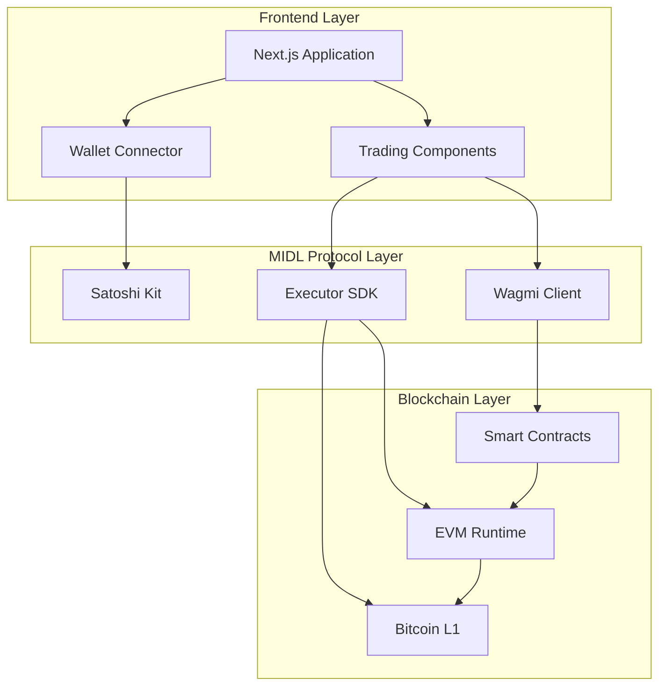
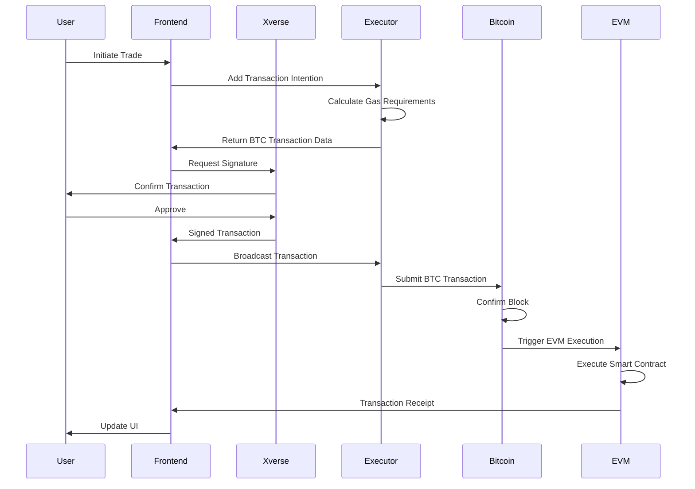

# MIDL Perpetual Exchange

A decentralized perpetual futures exchange built on MIDL Protocol, combining Bitcoin Layer 1 security with EVM smart contract functionality.

## Overview

This project implements a production-grade perpetual trading platform that leverages MIDL Protocol's unique architecture to provide trustless, Bitcoin-secured derivatives trading. The system enables traders to open leveraged positions while maintaining the security guarantees of Bitcoin's proof-of-work consensus.

## 📋 Deployed Contracts

### Regtest Deployment (February 2026)

All contracts successfully deployed to MIDL Regtest network.

#### mUSDT Stablecoin System

| Contract | Address | Purpose |
|----------|---------|---------|
| **mUSDT** | `0xA82c1B2b1171e32a3950A10FcEDbccc29995907f` | Algorithmic stablecoin (CDP-based, over-collateralized) |
| **PerpetualDEX** | `0x8247B5B9973D1f7dd34623b91e1252cdFf51526F` | Perpetual futures exchange using mUSDT as collateral |
| **Faucet** | `0x21Ce37A49cA9A291c5fA9ABA6e7eB720A1505aD8` | Testnet token faucet (DO NOT deploy to mainnet) |

#### Core Contracts

| Contract | Address | Purpose |
|----------|---------|---------|
| **PerpetualExchange** | `0xB6de03a50D0cfed70B5687c9461Cbf56545481cb` | Legacy perpetual futures trading contract |
| **MarginAccount** | `0x425A2E54f9eec665cfFf7c6F87fE69A90B800d7c` | Manages user margin accounts and locked margins |
| **TokenFactory** | `0x99fB32Dd45f43B5585bc86cB06c54aA56e519347` | Factory for creating meme tokens with bonding curve |
| **Token** | `0x6A8A491C81Ff46954C4eD22D91a633Aa2063F70C` | Base ERC20 token implementation |

#### Uniswap V2 DEX Infrastructure

| Contract | Address | Purpose |
|----------|---------|---------|
| **WETH9** | `0x78123C7a9523226543bAF753A2c53bd716d02452` | Wrapped native token for DEX trading |
| **UniswapV2Factory** | `0xa615c9f5B2555344658Ec5A4e499B171984010e4` | Creates Uniswap V2 trading pairs |
| **UniswapV2Router02** | `0xFB5D8eE9aD10a0e24aa23750B0D71e9Ce4a83887` | Router for swaps and liquidity management |

#### Wrapped Tokens (Multi-Asset Support)

| Token | Address | Symbol | Decimals | Purpose |
|-------|---------|--------|----------|---------|
| **WrappedBTC** | `0x79939104589669c632264909dfF99E5A7ab99cd8` | WBTC | 8 | Wrapped Bitcoin for perpetual trading |
| **WrappedETH** | `0xBA35a3207b893fd01C29f50CE5c8504a5Df5E0ad` | WETH | 18 | Wrapped Ethereum for perpetual trading |
| **WrappedSOL** | `0xfE78ca3296a6b8356c6A566ef56B6831178085cf` | WSOL | 9 | Wrapped Solana for perpetual trading |

**Network Details:**
- RPC URL: https://rpc.staging.midl.xyz
- Explorer: https://mempool.staging.midl.xyz
- Blockscout: https://blockscout.staging.midl.xyz

**Documentation:**
- System Overview: [packages/hardhat-midl/SYSTEM_OVERVIEW.md](packages/hardhat-midl/SYSTEM_OVERVIEW.md)
- Production Guide: [packages/hardhat-midl/PRODUCTION_GUIDE.md](packages/hardhat-midl/PRODUCTION_GUIDE.md)
- Full deployment details: [packages/hardhat-midl/DEPLOYMENTS.md](packages/hardhat-midl/DEPLOYMENTS.md)
- Machine-readable addresses: [packages/hardhat-midl/deployed-addresses.json](packages/hardhat-midl/deployed-addresses.json)
- Individual ABIs: `packages/hardhat-midl/deployments/*.json`

---

## Architecture

### System Components



### Transaction Flow



## Features

### Trading Capabilities
- Perpetual futures contracts with up to 10x leverage
- Long and short position support
- Multiple order types: Market, Limit, Stop
- Cross-margin and isolated-margin modes
- Real-time profit and loss calculation

### Technical Features
- Bitcoin Layer 1 transaction security
- EVM smart contract execution
- Xverse wallet integration via MIDL Satoshi Kit
- Real-time market data feeds
- Responsive interface for desktop and mobile
- Transaction state management with optimistic updates

## Technology Stack

### Smart Contracts
- Solidity 0.8.28
- Hardhat development environment
- OpenZeppelin security patterns
- Gas-optimized implementations

### Frontend
- Next.js 16 with App Router
- React 19 with TypeScript 5
- Tailwind CSS 4 for styling
- Jotai for state management
- TanStack Query for data fetching

### Blockchain Integration
- MIDL Protocol SDK (@midl/core, @midl/react, @midl/executor)
- Wagmi 2.14.16 for EVM interactions
- Viem 2.14.16 for low-level operations
- Xverse wallet connector

## Project Structure

```
midl-hackathon/
├── apps/
│   └── dashboard/              # Frontend application
│       ├── app/                # Next.js app router
│       ├── components/         # React components
│       ├── hooks/              # Custom React hooks
│       ├── lib/                # Utility functions
│       ├── states/             # Jotai state atoms
│       └── context/            # React context providers
├── contracts/                  # Solidity smart contracts
│   └── PerpetualExchange.sol  # Main trading contract
├── deploy/                     # Hardhat deployment scripts
├── scripts/                    # Setup and utility scripts
└── docs/                       # Additional documentation
```

## Getting Started

### Prerequisites

- Node.js 18 or higher
- pnpm package manager
- Xverse wallet browser extension
- Regtest BTC from MIDL faucet

### Installation

1. Clone the repository:
```bash
git clone <repository-url>
cd midl-hackathon
```

2. Install dependencies:
```bash
pnpm install
```

3. Configure environment variables:
```bash
cp apps/dashboard/.env.example apps/dashboard/.env.local
```

4. Set up Hardhat mnemonic:
```bash
npx hardhat vars set MNEMONIC
```

### Smart Contract Deployment

1. Obtain your Bitcoin address:
```bash
npx hardhat midl:address
```

2. Claim regtest BTC from the faucet at https://faucet.midl.xyz

3. Deploy the PerpetualExchange contract:
```bash
pnpm deploy:contracts
```

4. Update the contract address in `.env.local`:
```env
NEXT_PUBLIC_PERP_CONTRACT_ADDRESS=<deployed-address>
```

5. Verify the contract on Blockscout:
```bash
npx hardhat verify --network regtest <contract-address>
```

### Running the Application

Development mode:
```bash
pnpm dev
```

Production build:
```bash
pnpm build
pnpm start
```

The application will be available at http://localhost:3000

## Smart Contract Interface

### PerpetualExchange.sol

#### Core Functions

**deposit()**
```solidity
function deposit() external payable
```
Deposits funds into the trading account. Requires sending BTC value with the transaction.

**openPosition()**
```solidity
function openPosition(
    uint256 size,
    uint256 price,
    uint256 leverage,
    bool isLong
) external
```
Opens a new leveraged position. Parameters:
- `size`: Position size in wei
- `price`: Entry price in wei
- `leverage`: Leverage multiplier (1-10)
- `isLong`: true for long, false for short

**closePosition()**
```solidity
function closePosition(
    uint256 positionId,
    uint256 exitPrice
) external
```
Closes an existing position and realizes profit or loss.

**getPositions()**
```solidity
function getPositions(address trader) 
    external 
    view 
    returns (Position[] memory)
```
Returns all positions for a given trader address.

**getBalance()**
```solidity
function getBalance(address user) 
    external 
    view 
    returns (uint256)
```
Returns the account balance for a given user.

#### Events

```solidity
event PositionOpened(
    address indexed trader,
    uint256 indexed positionId,
    uint256 size,
    uint256 price,
    uint256 leverage,
    bool isLong
);

event PositionClosed(
    address indexed trader,
    uint256 indexed positionId,
    int256 pnl
);

event Deposit(address indexed user, uint256 amount);
event Withdrawal(address indexed user, uint256 amount);
```

## Network Configuration

### MIDL Regtest

- RPC URL: https://rpc.staging.midl.xyz
- Chain ID: 1337
- Block Explorer: https://blockscout.staging.midl.xyz
- Bitcoin Explorer: https://mempool.staging.midl.xyz
- Faucet: https://faucet.midl.xyz

## Development

### Running Tests

```bash
npx hardhat test
```

### Linting

```bash
pnpm lint
```

### Type Checking

```bash
pnpm type-check
```

## Deployment

For detailed deployment instructions, see [DEPLOYMENT.md](DEPLOYMENT.md).

For production deployment considerations, refer to the deployment guide which covers:
- Environment configuration
- Contract deployment and verification
- Frontend deployment to Vercel
- Monitoring and maintenance

## Testing

Comprehensive testing documentation is available in [TESTING.md](TESTING.md), including:
- Manual testing procedures
- Integration testing
- Performance testing
- Security considerations

## Documentation

- [QUICKSTART.md](QUICKSTART.md) - Quick setup guide
- [DEPLOYMENT.md](DEPLOYMENT.md) - Deployment instructions
- [TESTING.md](TESTING.md) - Testing procedures
- [ARCHITECTURE.md](ARCHITECTURE.md) - Technical architecture
- [CONTRIBUTING.md](CONTRIBUTING.md) - Contribution guidelines
- [CHANGELOG.md](CHANGELOG.md) - Version history

## Security Considerations

This project implements several security measures:

- Input validation on all user-provided data
- Reentrancy protection using checks-effects-interactions pattern
- Integer overflow protection via Solidity 0.8+
- Access control for position management
- Secure wallet connection flow

Note: This is experimental software. Use at your own risk. The contracts have not undergone formal verification.

## License

MIT License - see [LICENSE](LICENSE) for details.

## Resources

- [MIDL Protocol Documentation](https://docs.midl.xyz)
- [Hardhat Documentation](https://hardhat.org/docs)
- [Next.js Documentation](https://nextjs.org/docs)

## Support

For questions and support:
- Join the MIDL Discord community
- Review the documentation in the `/docs` directory
- Open an issue on GitHub

## Acknowledgments

Built for MIDL VibeHack 2026 (February 9-28, 2026).

Special thanks to the MIDL Protocol team for their support and the comprehensive developer tools that made this project possible.
