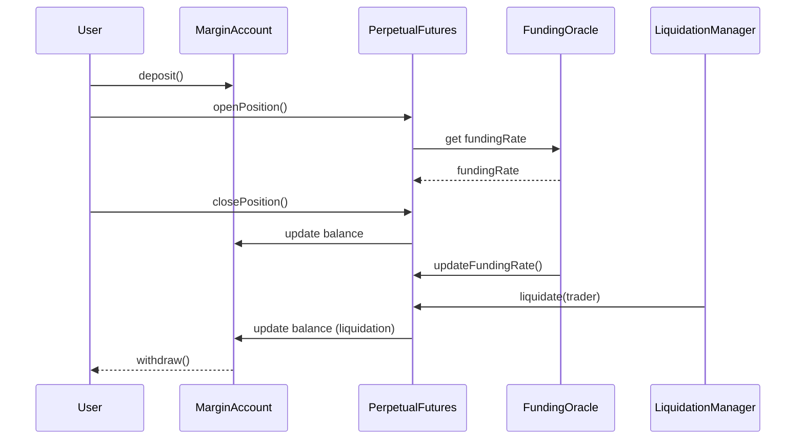
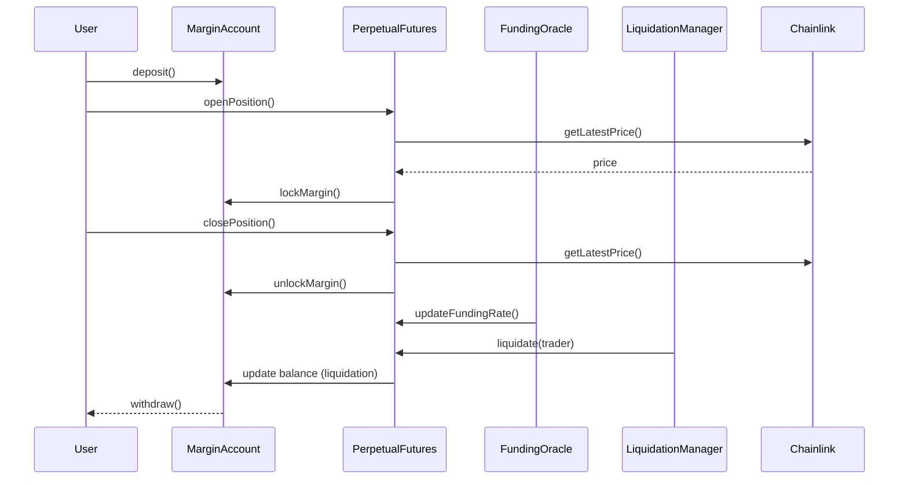

## Perpetual Futures Contracts

This project includes:

- PerpetualFutures.sol: Core perpetual futures logic
- MarginAccount.sol: Handles user margin deposits/withdrawals
- FundingOracle.sol: Updates and provides funding rates
- LiquidationManager.sol: Handles position liquidations

### Sequence Diagram



## Trading Perpetual Futures

This app is production-ready for trading perpetual futures on crypto assets using Chainlink price feeds.

### Contracts

- PerpetualFutures.sol: Trading logic, integrates Chainlink price feed
- MarginAccount.sol: Handles deposits, withdrawals, margin locking/unlocking
- FundingOracle.sol: Updates funding rates
- LiquidationManager.sol: Handles liquidations
- interfaces/AggregatorV3Interface.sol: Chainlink price feed interface

### Sequence Diagram



### Usage

- Deploy MarginAccount, PerpetualFutures, FundingOracle, LiquidationManager
- Use Chainlink price feed address for PerpetualFutures constructor
- Users deposit margin, open/close positions, and withdraw

### Example Chainlink Price Feed

- [ETH/USD Feed Address](https://docs.chain.link/data-feeds/price-feeds/addresses)

## Chainlink Price Feed Integration

This app uses Chainlink's official AggregatorV3Interface for secure price feeds. To trade futures on any crypto pair, set the correct feed address for your network and asset.

### Example: ETH/USD on Sepolia

- Feed address: `0x694AA1769357215DE4FAC081bf1f309aDC325306`
- Update your deployment script to pass this address to PerpetualFutures and FundingOracle constructors.

### Deployment Example

```js
const feed = "0x694AA1769357215DE4FAC081bf1f309aDC325306"; // ETH/USD Sepolia
const marginAccount = await ethers.deployContract("MarginAccount");
const perpetualFutures = await ethers.deployContract("PerpetualFutures", [
  feed,
  marginAccount.address,
]);
const fundingOracle = await ethers.deployContract("FundingOracle", [feed]);
const liquidationManager = await ethers.deployContract("LiquidationManager", [
  perpetualFutures.address,
  marginAccount.address,
]);
```

### Usage

- All price reads use Chainlink's latestRoundData, normalized to 18 decimals.
- You can change the feed address for other pairs/networks as needed.

# MIDL Hardhat Monorepo Setup

## 1. Install dependencies

```
pnpm install
```

## 2. Set your Bitcoin mnemonic

```
npx hardhat vars set MNEMONIC
```

Paste your BIP39 mnemonic when prompted.

## 3. Deploy the contract

Make sure you have Bitcoin on Regtest. You can claim some at the faucet or by contacting the MIDL team on Discord.

Get your Bitcoin and EVM addresses:

```
pnpm hardhat midl:address
```

Deploy the contract:

```
pnpm hardhat deploy
```

## 4. Verify the contract

After deployment, verify the contract on the block explorer:

```
pnpm hardhat verify REPLACE_WITH_CONTRACT_ADDRESS "Hello from MIDL" --network regtest
```

## Notes

- The deployments folder will contain deployment info after running the deploy command.
- For advanced usage, see the official MIDL documentation and plugin repos.
